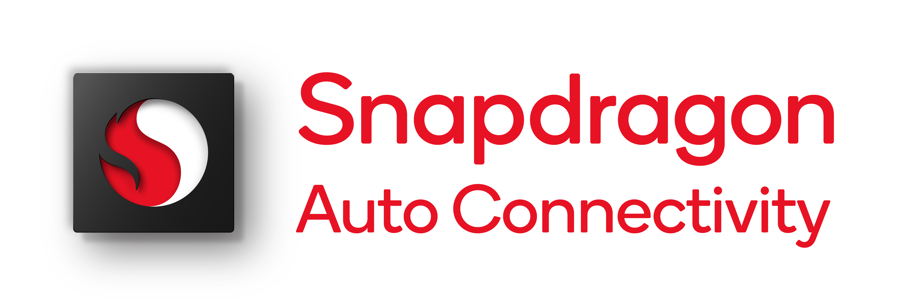

<!-- logo and links -->

<b><a href="https://developer.qualcomm.com/docs/auto-connectivity/telematics/api">API reference</a></b>
|
<b><a href="https://docs.qualcomm.com/bundle/publicresource/topics/80-41102-1">User Guide</a></b>
|
<b><a href="https://docs.qualcomm.com/bundle/publicresource/topics/80-41102-5/">Release Notes</a></b>
|
<b><a href="https://docs.qualcomm.com/bundle/publicresource/topics/80-41102-4">Tools Overview</a></b>
|
<b><a href="https://developer.qualcomm.com/software/digital-chassis/telematics-application-framework/tutorial-videos">Tutorial Videos</a></b>

 

# Snapdragon® Telematics Application Framework

Snapdragon® Telematics Application Framework (TelAF) is a unified development environment including DoIP/UDS enablement, TCU oriented design with VHAL, modem and platform abstractions on SOC, OEM/Tier 1 peripheral support, communication with other ECUs using SOME/IP, application lifecycle management with security and IPC based APIs for building cloud-connected apps and services. The framework is a set of build/debug/code-generation tools and support designed to simplify application development.
 

#### License
TelAF is licensed under the BSD-3-Clause-Clear License.

